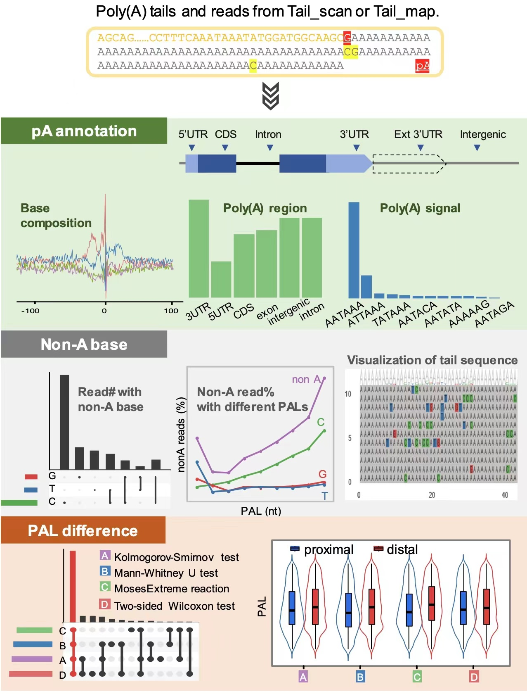

# PolyAtailor
A user-friendly R package for measuring poly(A) tail length from NGS-based short-read and PacBio-based long-read sequencing data.


## About
&nbsp;&nbsp;The poly(A) tail is a dynamic addition to the eukaryotic mRNA and the change in its length plays an essential role in regulating gene expression. Only recently high-throughput sequencing strategies began to emerge for transcriptome-wide profiling of poly(A) tail length in diverse developmental stages and organisms. However, there is currently no easy-to-use and universal tool for measuring poly(A) tails in sequencing data from different sequencing protocols. Here we established PolyAtailor, a unified and efficient framework, for identifying and analyzing poly(A) tails from PacBio-based long reads or next generation short reads. Particularly, PolyAtailor can identify multiple tails in a read, with detailed information of tail type, tail position, tail length and tail sequence.    
     
     
&nbsp;&nbsp;PolyAtailor takes a sequence file in FASTQ or FASTA format as the input. First, the Tail_scan function can be used for tail extraction, tail filtering and tail classification. If a reference genome is available, then the result from Tail_scan can be further corrected using the Tail_map function. After obtaining results of poly(A) tails from Tail_map or Tail_scan, users can use additional functions in PolyAtailor for poly(A) site identification and annotation, as well as the visualization of base compositions of poly(A) tails, and the detection of PAL (Poly(A) Length) differences under different conditions.     
 
<div align = 'center'>  </div>  
<div align = 'center'> <font size='15'> Figure 1. Schematic of PolyAtailor. </font> </div> <br>      

<div align = 'center'>  </div>
<div align = 'center'> <font size='15'> Figure 2. Downstream analyses of poly(A) tails with PolyAtailor. pA, poly(A) site; PAL, poly(A) length.
 </font> </div>


## Getting started  
### Mandatory
* R (>=3.5.0). [R 3.6.2](https://www.r-project.org/) is recommended.
### Required R Packages
* [dplyr](https://CRAN.R-project.org/package=dplyr), [reshape2](https://CRAN.R-project.org/package=reshape2), [IRanges](http://www.bioconductor.org/packages/release/bioc/html/IRanges.html), [GenomicRanges](http://www.bioconductor.org/packages/release/bioc/html/GenomicRanges.html), [RColorBrewer](https://CRAN.R-project.org/package=RColorBrewer), [data.table](https://CRAN.R-project.org/package=data.table), [ggplot2](https://CRAN.R-project.org/package=ggplot2), [Biostrings](http://www.bioconductor.org/packages/release/bioc/html/Biostrings.html), [BSgenome](http://www.bioconductor.org/packages/release/bioc/html/BSgenome.html), [ggbio](http://www.bioconductor.org/packages/release/bioc/html/ggbio.html), [rtracklayer](http://www.bioconductor.org/packages/release/bioc/html/rtracklayer.html), [GenomicFeatures](http://www.bioconductor.org/packages/release/bioc/html/GenomicFeatures.html), [DESeq2](http://www.bioconductor.org/packages/release/bioc/html/DESeq2.html), [DEXSeq](http://www.bioconductor.org/packages/release/bioc/html/DEXSeq.html), [movAPA](https://github.com/BMILAB/movAPA), [ggmsa](http://yulab-smu.top/ggmsa/articles/ggmsa.html)
### Installation
* Install the R package using the following commands on the R console:

```
install.packages("devtools")
require(devtools)
install_github("BMILAB/PolyAtailor")
library(PolyAtailor)

##or you can download ZIP, and then
install.packages("you download path", repos = NULL, type = "source")
```  
## Attention
If you encounter the problem that the *ggmsa* package or *GenomicRanges* package does not work in some R versions, you can directly extract the two files in the *patch* folder and copy them to the library path in R.
